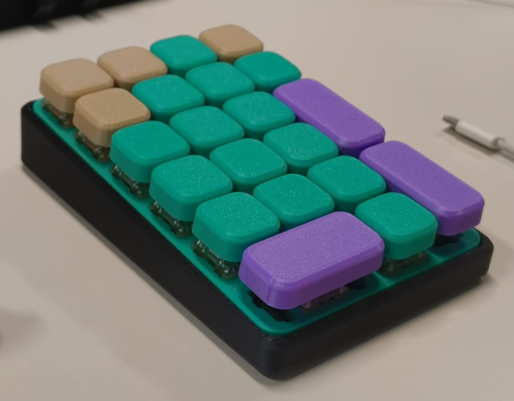
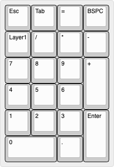
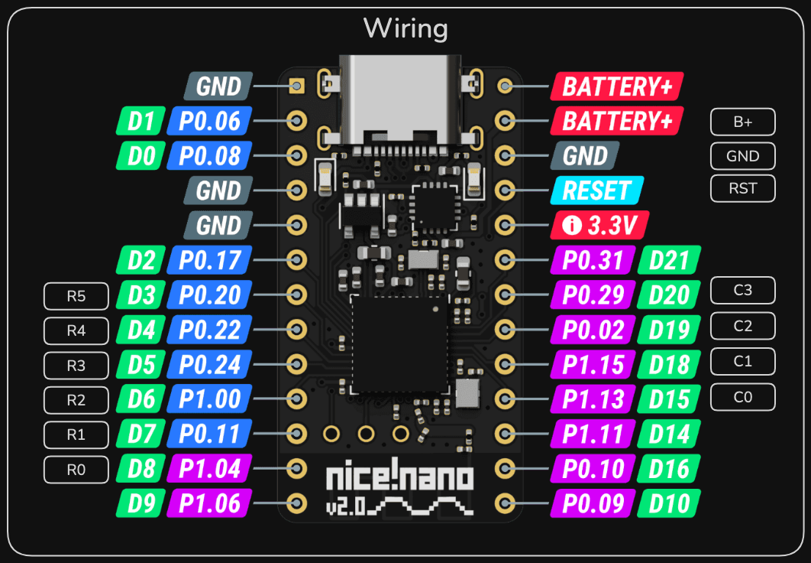

# NumPad01 - PCB

This Repository outlines the requirements to build a custom Keyboard with an expanded Numpad layout.

## Hardware
This Keyboard is built using the NiceNanoV2 NRF Module to leverage its Bluetooth capabilities.

It is possible to Handwire this keyboard. Altough it was deisgned with a PCB in mind.

The KiCAD files can be found in [Numpad1](/Numpad1/).
The PCB is designed to use MX Hotswap sockets.

### Key Layout
The expanded Numpad layout looks as follows.\

### Wiring
In the following Diagram it is described which pins of the NiceNanoV2 are to be soldered to the Pads on the PCB.

### Enclosure
I have deisgned a very slim Case for the PCB with just enough space for a small LiPo. You can find the OnShape Project at this [Link](https://cad.onshape.com/documents/f554f5fd452e23ddbeb69b48/w/c72bd622fd985e9e9cbd8d4f/e/263bace952513a244bd67565) or checkout the STEP files in [CAD/case](CAD/case).

###  Keycaps
This Keyboard has 21 Keys in Total.
| Amount | Type |
| ------ |----- |
| 18     | 1u   |
| 3      | 2u   |

Custom Keycaps were designed for this project, while 3D printed Keycaps may not be optimal they surely look good.

You can find the OnShape Project at this [Link](https://cad.onshape.com/documents/af3d93fce92099b4708cc048/w/839bc3040b2b1ff49a4ff1b0/e/539817a75a59442267b910fb). Since I made multiple versions I won't upload them here.

## Firmware
To utilize the full Bluetooth capabilites of the NiceNanoV2 the ZMK firmware was used. This the Keymap of this config can be changed using [Nick's Keymap Editor](https://nickcoutsos.github.io/keymap-editor/).

You can find the latest firmware on the [Releases](https://github.com/KingJacker/zmk-config-numpad01-pcb/releases/tag/release) Page.

### Flashing
If you are starting out and haven't falshed anything to the NiceNanoV2, you need to short the RESET pin to GND twice in short succession while plugged in via USB C. 

The red light will Blink and a drive will appear on your computer with the name "NiceNanoV2". Simply drag the firmware file into drive. 

That's it, the drive will disappear and the NiceNanoV2 will reboot.

Once you have flashed this firmware you can always access the bootloader to update the firmware by pressing the Layer 1 Key and Plus at the same time.